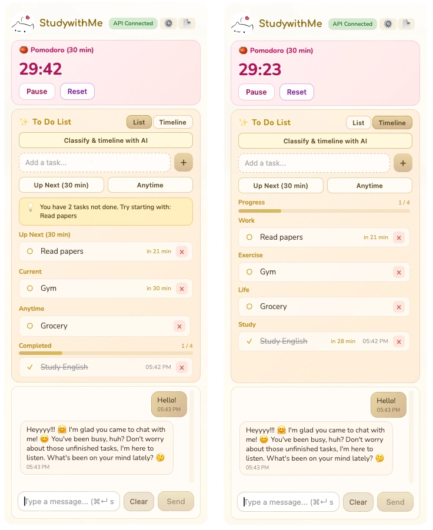

<p align="center">
  <a href="https://github.com/mingmichelle0414/Learny/releases/latest">
    
  </a>
  <a href="https://github.com/mingmichelle0414/Learny/blob/main/LICENSE">
    
  </a>
  <a href="https://github.com/mingmichelle0414/Learny">
    
  </a>
  <a href="https://github.com/mingmichelle0414/Learny/releases">
    
  </a>
  
</p>

---

## Learny – A tiny study companion on your desktop

<table cellpadding="0" cellspacing="0" style="border:none">
<tr>
<td width="52%" valign="top" style="padding-right:20px;padding-bottom:0;line-height:1.6">

**Learny** is a minimal macOS desktop app that combines:

- ⏱️ **Pomodoro** — 30‑minute focus timer  
- ✅ **To Do list** — Up Next / Current / Anytime / Completed  
- 💬 **AI chat** — Gemini, OpenAI, or Cerebras  
- ☁️ **iCloud** — optional sync + daily summary  

All in a small always‑on‑top window that stays with you while you study or work.

---

**⏱️ Pomodoro (30 min)**  
One‑click focus session. **Start / Pause / Reset**. A small “Time’s up” hint when done. Stays visible but unobtrusive.

**✅ To Do list**  
- **Up Next (30 min)** — Highest priority; from now to the next 30 minutes, do right away.  
- **Current** — What you’re doing now; no due pressure, won’t overdue.  
- **Anytime** — Not urgent but still need to get done.  
- **Overdue / Other** — Items with due times. **Completed** — Done, with timestamps.  

Add, check off, delete quickly. **Move arrows** or **drag** from Anytime/Overdue into Current / Up Next.

**💬 Friendly AI chat (“Say something?”)**  
Works with **Gemini**, **OpenAI**, or **Cerebras**. API keys stored **locally only**. Set a **custom system prompt** in Settings (warm friend, study buddy, productivity coach).  
**☁️ iCloud sync & daily summary (optional)**    
In **Settings → Advanced**, choose a **Daily summary & sync folder** (iCloud Drive recommended). Learny keeps `.studywithme-todos-sync.json` for sync and writes `studywithme-daily.md` with completed tasks. Manual export from Settings when you like.</td>
<td width="48%" valign="top" style="padding-left:0;padding-bottom:0;vertical-align:top">

</td>
</tr>
</table>

---

## 🚀 Quick Start

**macOS (Apple Silicon)** · [**Download DMG (v0.1.0)**](https://github.com/mingmichelle0414/Learny/releases/tag/v0.1.0)

1. Remove the macOS quarantine attribute (in Terminal, from the folder where you downloaded the DMG):
   ```bash
   xattr -cr Learny_0.1.0_aarch64.dmg
   ```
2. Open the DMG and drag **Learny.app** into your **Applications** folder.
3. Launch from Applications or Spotlight.

If macOS still blocks the app after opening, run in Terminal:

```bash
xattr -cr Learny.app
```
or (if the app is already in Applications):

```bash
xattr -cr /Applications/Learny.app
```

---

## Basic usage

### 1. Choose and configure your AI provider

1. Click the **Settings (gear)** icon in the header.  
2. Under **“Use for chat”**, choose:
   - Gemini (Google)  
   - OpenAI (ChatGPT)  
   - Cerebras  
3. Paste your API key for the selected provider.  
4. Click **Test connection** until you see the **green “API connected”** badge in the header.

You can also:

- Choose a **model** (e.g. `gemini-1.5-flash`, `gpt-4o-mini`, `llama3.1-8b`) or leave it on `Auto`.  
- Set a **Custom system prompt** to change the assistant’s personality (warm friend, strict coach, etc.).

### 2. Add and organize tasks

- **Add:** use the `Add a task...` field; use **Up Next (30 min)** or **Anytime** to categorize.
- **Manage:** checkbox to mark done; **arrows** (↑ / ↓ and ↗ Move) to reorder or move between groups; **drag & drop** from Anytime/Overdue into Up Next / Current.

### 3. Chat with the AI

Use the **“Say something?”** field at the bottom: **⌘ + Enter** to send. You can clear your conversation, copy text, paste tasks or links, and click links to open in your browser.

### 4. Syncing tasks on a new Mac (optional)

1. **Settings → Advanced → Daily summary & sync folder** — choose the *same* iCloud folder as on your first Mac.  
2. Close Settings and click the app title at the top (“StudywithMe / Learny”). Learny will load `.studywithme-todos-sync.json` and restore your tasks.

---

## Privacy & data

| | |
|:--|:--|
| **Local by default** | Tasks, settings, and API keys stay on your Mac. |
| **iCloud (optional)** | To Do JSON + daily summary Markdown in your iCloud Drive. |
| **Chat** | Requests go directly to the provider you choose; no server, no logging. |

---

## Disclaimer

Learny is an experimental project for learning and personal use. The software is provided **“as is”** with no warranties; you use it at your own risk. The author is not liable for any damages. Learny is not affiliated with OpenAI, Google, or Cerebras; AI requests go to the provider you configure, and their terms apply.

---

## License

Copyright (c) 2026 The owner of this GitHub repository.

**Permitted:** Personal use and study; view and modify source code; share in original form.

**Not permitted** (without prior written permission): Commercial use; sell or redistribute as a paid product; offer as part of a commercial service.

THE SOFTWARE IS PROVIDED "AS IS", WITHOUT WARRANTY OF ANY KIND, EXPRESS OR IMPLIED, INCLUDING BUT NOT LIMITED TO THE WARRANTIES OF MERCHANTABILITY, FITNESS FOR A PARTICULAR PURPOSE AND NON-INFRINGEMENT. IN NO EVENT SHALL THE COPYRIGHT HOLDER BE LIABLE FOR ANY CLAIM, DAMAGES OR OTHER LIABILITY ARISING FROM THE USE OF THIS SOFTWARE.